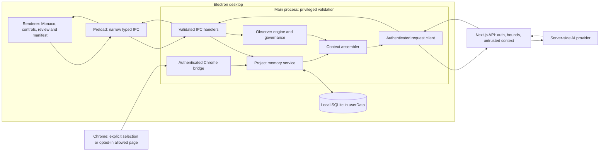

# Observer-Intervener Engine

Phase 0 architecture skeleton — 2026-10-02. This document describes the planned
engine, not a shipped implementation. The authoritative requirements are in
[OBSERVER_ENGINE_SPEC.md](./OBSERVER_ENGINE_SPEC.md); progress and measured
verification results belong in [DESKTOP_IDE_PLAN.md](./DESKTOP_IDE_PLAN.md).
The [product-direction amendment](./PRODUCT_DIRECTION.md) preserves the earlier
direction and records the bounded opt-in change.

## Planned architecture and trust boundaries

The memory, engine and assembler nodes are planned components. The bridge,
authenticated request path, editor and review infrastructure already exist;
page capture and memory ingestion are future extensions. Arrows show controlled
data flow, not direct renderer access to a database, filesystem or credentials.
Pure contracts and algorithms belong in `shared/`, privileged work in `main/`,
and UI in `renderer/`. Preload exposes purpose-specific methods, never a generic
privileged invoke function.

## Reuse before extension

- Evolve `main/live-observer.ts` generation, cancellation, candidate and dedupe
  mechanics; preserve the existing live path until its planned migration.
- Extend `main/project-context.ts` and its shared helpers for symbols, related
  files, budgets and provenance. Reuse `shared/context-tray.ts` redaction and
  `shared/settings.ts` mandatory/user exclusions.
- Reuse workspace authorization, safe paths and `workspace-watcher.ts` for scans
  and external changes. Store the future database only under Electron `userData`.
- Extend the authenticated Chrome bridge while retaining selection review and
  Context Tray controls. Page text is untrusted data, never prompt instructions.
- Retain hash-checked diff review, explicit Accept, Monaco undo, checkpoints and
  transactional multi-file rollback. Keep technical-error nudges separate.
- Retain Next.js authentication and server-only provider-key handling.

## Independent memory and proactive controls

| Memory | Proactive timer | Planned behavior |
|---|---|---|
| On | On | Record eligible deltas; after a content-change pause, run governance before any request |
| On | Off | Continue memory capture; no proactive timers, automatic requests or governance activity; manual requests may use stored context |
| Off | On | Invalid combination; disable the timer and treat as both off |
| Off | Off | Plain editor; no journaling, web ingestion or automatic requests |

Only content deltas and second-resolution timestamps are recorded. No keystroke
timing, speed, cursor traces, window titles, attention/productivity metrics or
"stuck" inference. Disabling the timer cancels pending work and aborts in-flight
engine requests; enabling it requires a new edit. Pausing memory stops capture
immediately. The UI must disclose both states.

## Planned context and suggestion flow

Eligible content changes feed local memory independently of the timer. With the
timer enabled, visibility, delta, kill-switch, rate, dedupe and privacy gates
control requests. The assembler returns bounded blocks A–J and a manifest of
what was included or omitted. The backend validates bounds and wraps code/web
text as untrusted context before provider access. A valid result is a proposal:
the user reviews and explicitly accepts or dismisses it. Outcomes update local
history and governance; automatic apply and command execution remain forbidden.

Mandatory-secret and user-excluded files are metadata-only. Secret-flagged
content must be purged and excluded. Project files, journal and web captures
never sync to Supabase. Optional suggestion-history sync is specified off; its
future payload requires review against the same privacy boundaries. Logs contain
only permitted counts, sizes, hashes and error categories.

## Verification and future documentation

Phase 0 changes documentation only. It does not add SQLite, IPC, capture, timers,
provider calls or tests. See the plan for the current baseline, including failures
and environment limitations. New tests in later phases must use `node --test`
and be registered in the existing desktop test script. Each phase runs all §13
global gates and its §14 checks, then stops for review.

- TODO(spec §4–5, E1–E2): document the implemented schema, scan, replay,
  compaction, secret purge, retention and native packaging evidence.
- TODO(spec §6–8, E3–E4): document actual manifest examples, governance outcomes
  and provider behavior. Claim streaming only where real provider streaming works.
- TODO(spec §9, E5): document implemented pairing, revocation, allow/deny policy,
  review and auto-ingestion; update the existing ADR at that phase.
- TODO(spec §11, E6): add the implemented new-project walkthrough.
- TODO(spec §12–13, E7): add local evaluation evidence, accessibility checks,
  screenshots and clean-machine results. API savings and AI accuracy are measured
  outcomes, not guarantees. This skeleton is not whole-feature acceptance evidence.

Supervisor sign-off and owner decisions in spec §16 remain pending. Phase E1
starts only after an explicit follow-up instruction; Phase 0 does not authorize it.
